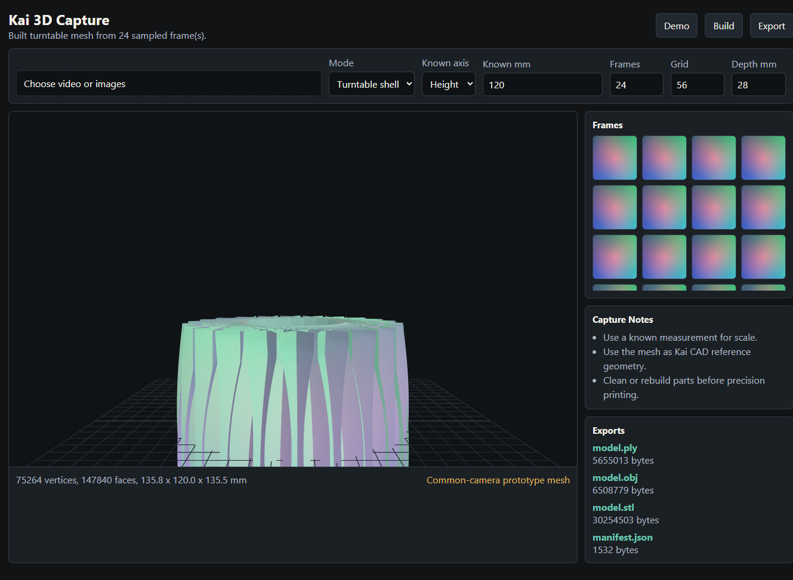

# Kai 3D Capture

Kai 3D Capture turns ordinary video frames or still images into scaled 3D working meshes for prototype design, on-screen modeling, 3D-print cleanup, and Kai CAD handoff.

This is not a metrology scanner replacement. A common camera cannot honestly match a blue-laser scanner that claims 0.015 mm accuracy. This repo is for common-camera capture: visual meshes, rough dimensions, known-scale references, CAD reconstruction assistance, and exportable model artifacts.

## Screenshot




## Two Finishes

1. **Kai Browser integration finish**
   - Local HTTP API: `src/server/kai-capture-server.mjs`
   - Browser import package: `integration/kai-browser/kai-capture-client.mjs`
   - Contract docs: `docs/KAI_BROWSER_INTEGRATION.md`
   - Output manifest for Kai CAD: `kai-capture-manifest.v1`

2. **Standalone app finish**
   - Electron desktop app.
   - Imports image sets and videos.
   - Extracts video frames in the app.
   - Builds textured relief or turntable-shell meshes.
   - Exports `.ply`, `.obj`, `.stl`, and `.json` manifests.
   - Windows installer build script: `scripts/Build-Installer.ps1`

## Quick Start From Source

```powershell
cd C:\Users\Jae\Desktop\kai-3d-capture
npm install
npm run verify
npm start
```

## Build Windows Installer

```powershell
.\scripts\Build-Installer.ps1
```

Expected outputs:

- `dist\installer\Kai 3D Capture Setup 0.1.0.exe`
- `dist\installer\Kai 3D Capture 0.1.0.exe`

## Kai Browser API

```powershell
node src/server/kai-capture-server.mjs --port 3947 --workspace C:\Users\Jae\Desktop\Kai3DCaptureJobs
```

Health check:

```powershell
Invoke-WebRequest -UseBasicParsing http://127.0.0.1:3947/health
```

Reconstruct endpoint:

```text
POST http://127.0.0.1:3947/api/reconstruct
```

The request accepts sampled frame grids instead of raw private video by default. Kai Browser can do media sampling client-side, then send only the compact reconstruction samples to the local service.

## What The Current Engine Does

- **Relief mode:** builds a front-facing height-field mesh from one or more images.
- **Turntable mode:** places sampled image panels around a vertical axis to create a scaled, textured prototype shell from a walkaround/turntable video.
- **Known measurement:** scales the model in millimeters using a user-supplied width, height, or depth reference.
- **Exports:** PLY with vertex color, OBJ geometry, STL triangle mesh, and a JSON manifest.

## Truth Limits

- This v0.1 is useful for prototypes, visual models, concept capture, and Kai CAD reconstruction assistance.
- It is not engineering-grade metrology.
- Shiny, transparent, black, textureless, blurry, and occluded objects remain hard.
- For high-detail photogrammetry, this repo is prepared for COLMAP/Meshroom/NeRF/Gaussian Splatting adapters, but those engines are optional and not bundled in v0.1.

